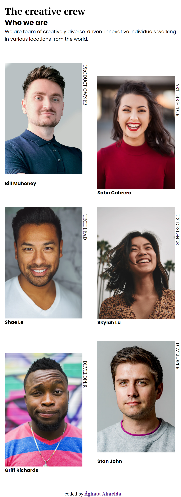
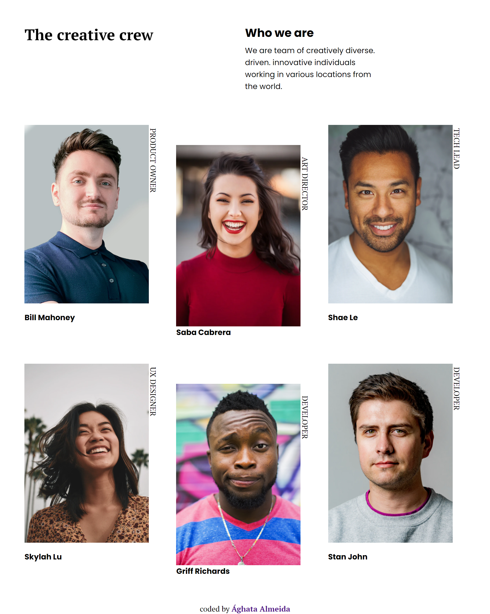

<!-- Please update value in the {}  -->

<h1 align="center">My team - Página de apresentação da equipe</h1>

   Solução para um desafio de <a href="http://devchallenges.io" target="_blank">Devchallenges.io</a>.

  <h3>
    <a  target="_blank" href="https://{your-demo-link.your-domain}">
     Preview
    </a>
     | 
    <a target="_blank" href="https://devchallenges.io/challenges/hhmesazsqgKXrTkYkt0U">
      Desafio
    </a>
  </h3>

<!-- TABLE OF CONTENTS -->

## Índice

- [Visão Geraç](#visão-geral)
  - [Ferramentas](#ferramentas)
- [Features](#features)
- [Contato](#contato)

<!-- OVERVIEW -->

## Visão Geral

O objetivo desse desafio era de criar uma página responsiva de acordo com o [design](https://devchallenges.io/challenges/hhmesazsqgKXrTkYkt0U).

### Ferramentas

<!-- This section should list any major frameworks that you built your project using. Here are a few examples.-->

- HTML5
- SASS/SCSS
- CSS Grid
- CSS flexbox
- Google Fonts

## Features

Esse site foi criado como uma solução ao [challenge](https://devchallenges.io/challenges/hhmesazsqgKXrTkYkt0U) disponível no site [DevChallenges](https://devchallenges.io/challenges).

## Contato

- Linkedin <a href="https://www.linkedin.com/in/aghata-almeida/"  target="_blank" >Ághata Almeida</a>
